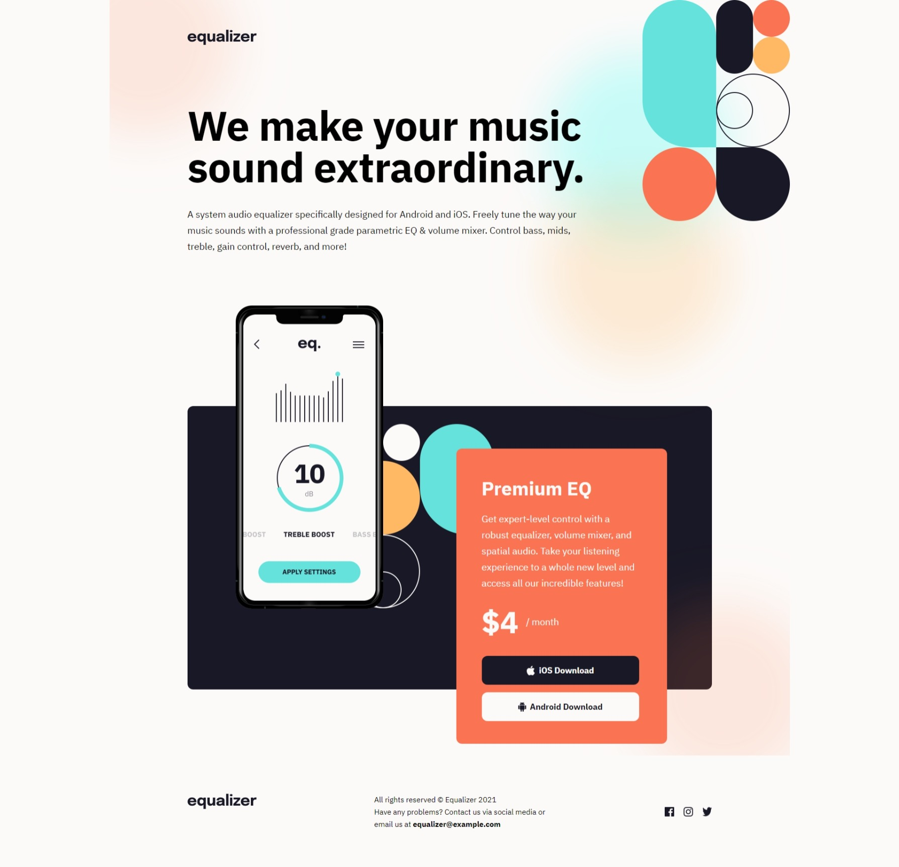

# Frontend Mentor - Equalizer landing page solution

This is a solution to the [Equalizer landing page on Frontend Mentor](https://www.frontendmentor.io/challenges/equalizer-landing-page-7VJ4gp3DE/hub). Frontend Mentor challenges help you improve your coding skills by building realistic projects.

## Overview

### The challenge

Users should be able to:

- View the optimal layout depending on their device's screen size
- See hover states for interactive elements

### Screenshot

### Links

- Solution URL: [Frontend Mentor]()
- Live Site URL: [Netlify](https://zesty-rugelach-540f10.netlify.app/)

## My process

### Built with

- Semantic HTML5 markup.
- CSS custom properties.
- Flexbox.
- CSS absolute position.
- No frameworks (only pure HTML and CSS 🏅).

## Author

- LinkedIn - [Abilio Assis](https://www.linkedin.com/in/abilio-assis/)
- Frontend Mentor - [@abilioassis](https://www.frontendmentor.io/profile/abilioassis)
